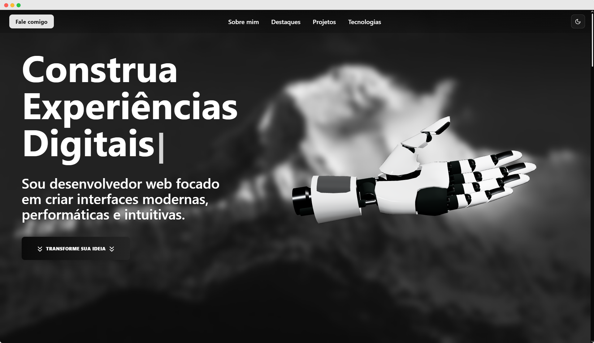

# Gustavo Almeida | Front-end Portfolio

## Demonstration

| Link to my portfolio: [https://gustavo-almeida-portfolio.vercel.app](https://gustavo-almeida-portfolio.vercel.app)

  

---

## About

This is the professional portfolio of **Gustavo Almeida**, a front-end developer specialized in React, Next.js, and modern web technologies. It showcases projects, skills, and experiences focused on modern, accessible, and performant user interfaces.

---

## Technologies

- **Next.js** (v15) with React 19 and TypeScript 5  
- Styling with Tailwind CSS and animations using Framer Motion  
- Three.js integration for 3D experiences  
- Theme management with `next-themes` supporting **dark mode**  
- Contact form protected by Google reCAPTCHA  
- SEO optimized with Next.js 13+ metadata configuration  

---

## Key Features

- **Dark Mode**: automatic light/dark based on system preference, with manual toggle by the user.   
- Responsive, accessible navigation optimized for mobile and desktop devices.  
- Advanced SEO with Open Graph, dynamic metadata, and tags for better ranking.  
- Google reCAPTCHA integration to prevent spam in the contact form.

---

## How to run locally

1. Clone the repository:  
   ```bash
   git clone https://github.com/yourusername/gustavo-almeida-portfolio.git
   ```

2. Install dependencies:  
   ```bash
   npm install
   # or
   yarn install
   ```

3. Setup environment variables in `.env.local`:  
   ```
   NEXT_PUBLIC_RECAPTCHA_SITE_KEY=your-recaptcha-site-key
   ```

4. Start development server:  
   ```bash
   npm run dev
   # or
   yarn dev
   ```

5. Open [http://localhost:3000](http://localhost:3000) in your browser.

---

## Deployment

This project can be easily deployed to platforms like Vercel, Netlify, or any Next.js-compatible environment.

---

## Contributions

This is a personal portfolio repository, but contributions and suggestions are welcome!  
Please open issues to report bugs or discuss improvements.

---

## License

MIT License © 2025 Gustavo Almeida
